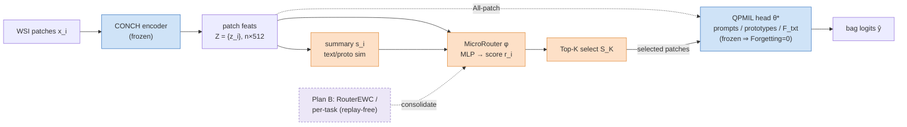

# Method — formulas, architecture, draft (v0.4)

> 配合 [PAPER_OUTLINE_v0.4.md](PAPER_OUTLINE_v0.4.md)。所有公式都對齊真實程式碼：
> router=`navipath_moe/routers.py`、訓練/EWC=`train_router_v0.py`、
> heuristics=`eval/patch_budget_eval.py`、backbone=`navipath_moe/qpmil_adapter.py`。
> **Plan B 相關段落以 `⟦TODO Plan B⟧` 標記，等 fold1 結果回來再補數字。**

---

## 1. 架構圖 Fig 1

- **向量檔（投稿用）**：`outputs/figs/Fig1_arch.pdf`（`outputs/figs/Fig1_arch.png` 預覽）。
- **改圖**：編輯 `tools/draw_arch.py` 的 box/text 後重跑 `python tools/draw_arch.py`，**不用碰 PowerPoint**。

### Mermaid（快速 iterate 用；改完順了再以上面的 PDF 為準）



---

## 2. 五條核心公式（LaTeX，可直接貼）

**Notation**：一張切片有 $n$ 個 patch，特徵 $z_i\in\mathbb{R}^{512}$（CONCH，frozen）。
$\hat{(\cdot)}$ 表 L2-normalize。$\{t_c\}_{c=1}^{C}$ 為類別文字特徵（`class_text_features`），
$\{p_m\}_{m=1}^{M}$ 為 prototype 文字特徵（`prototype_features`）。router 參數 $\phi$。

### (1) 每個 patch 的 summary 統計 + scalar router score
```latex
s_i = \Big[\;\max_c \hat{z}_i^\top \hat{t}_c,\;\;
            H\!\big(\mathrm{softmax}_c\,\hat{z}_i^\top \hat{t}\big),\;\;
            \max_m \hat{z}_i^\top \hat{p}_m,\;\;
            \tfrac{1}{M}\!\sum_m \hat{z}_i^\top \hat{p}_m \;\Big]\in\mathbb{R}^4,
\qquad
r_i = \mathrm{MLP}_\phi\!\big([\,z_i \,;\, s_i\,]\big)\in\mathbb{R}.
```
*一句話*：把「每個 patch 對類別文字 / prototype 的相似度」壓成 4 維固定統計（與任務數 $C$ 無關），接上 patch 特徵丟進小 MLP，輸出純量重要度 $r_i$。

### (2) 預算下的 Top-K 選擇（推論時硬選）
```latex
\mathcal{S}_K = \operatorname*{Top\text{-}K}_{i\in\{1,\dots,n\}} r_i,
\qquad |\mathcal{S}_K| = K .
```
*一句話*：只保留分數最高的 $K$ 個 patch（budget），其餘丟棄。

### (3) 可微分 soft-route 訓練目標（只訓 $\phi$，backbone 凍結）
```latex
w_i = \frac{\exp(r_i)}{\sum_{j\in\mathcal{S}_K}\exp(r_j)},\quad
\bar{z} = \widehat{\sum_{i\in\mathcal{S}_K} w_i\, z_i},\qquad
\mathcal{L}_{\text{route}} = \mathrm{CE}\!\big(\,\sigma\,\bar{z}\,F_{txt}^\top,\; y\,\big),
```
*一句話*：對選中的 $K$ 個 patch 做 softmax 加權聚合成 bag 向量 $\bar z$，過凍結的 text 分類器算交叉熵；梯度只經由權重 $w_i$ 流回 router $\phi$（$\sigma$ 為 QPMIL 的 logit scale）。

### (4) Decoupled prediction（凍結 backbone ⇒ Forgetting 為恆等）
```latex
\hat{y} = \arg\max\; g_{\theta^\ast}\!\big(\{z_i\}_{i\in\mathcal{S}}\big),
\qquad \theta^\ast \text{ frozen} \;\Rightarrow\; \mathrm{Forgetting}\equiv 0 .
```
*一句話*：分類永遠由凍結的 QPMIL backbone $g_{\theta^\ast}$ 在**原始**特徵上做；router/expert 不碰預測路徑，所以 backbone 層級 Forgetting$=0$ 是**設計上的恆等式**（誠實聲明，非貢獻）。

### (5) ⟦TODO Plan B⟧ EWC-on-router consolidation（replay-free）
```latex
F^{(t)}_j = \mathbb{E}_{(x,y)\sim \mathcal{D}_t}\!\Big[\big(\partial \mathcal{L}_{\text{route}}/\partial \phi_j\big)^2\Big],\quad
\phi^{\ast(t)} = \phi,\qquad
\mathcal{L}^{(t+1)} = \mathcal{L}_{\text{route}} + \lambda \sum_{\tau\le t}\sum_j F^{(\tau)}_j\big(\phi_j-\phi^{\ast(\tau)}_j\big)^2 .
```
*一句話*：每學完一個任務，用 diagonal Fisher $F^{(t)}$ 記住「router 哪些權重對該任務重要」與當時最優解 $\phi^{\ast(t)}$；之後新任務在 loss 上加二次懲罰，抑制重要權重漂移（對照組 per-task router＝每任務存一份，當上界）。

> 補充（MoE ablation，非主線）：完整 MoE 版另含語義錨 $\mathcal{L}_{\text{sem}}=\mathrm{KL}(q\|\pi)$、
> 負載平衡 $\mathcal{L}_{\text{bal}}$、路由蒸餾 $\mathcal{L}_{\text{route}}^{\text{KD}}$（見 `navipath_moe/losses.py`），
> 但主結果只用上式 (3) 的單一 CE soft-route。

---

## 3. Method section（English draft，可投稿；Plan B 留 TODO）

### 3.1 Problem setup
We study class-incremental whole-slide image (WSI) classification under a fixed
feature budget. A frozen pathology foundation model (CONCH) encodes each slide
into $n$ patch features $z_i\in\mathbb{R}^{512}$. Tasks $t=1,\dots,T$ arrive
sequentially; after task $t$ the model must classify slides from all seen tasks
using at most $K$ patches per slide ($K\ll n$). We deliberately separate two
sub-problems that the literature usually conflates: *what to predict* (the
classifier) and *what to look at* (patch selection).

### 3.2 Decoupled prediction backbone
For prediction we reuse a prompt-based continual MIL head (QPMIL) on top of the
frozen CONCH features. Crucially, the prediction path never consumes
router- or expert-transformed features (Eq. 4): the backbone $g_{\theta^\ast}$
always sees the original $z_i$. A direct consequence is that backbone-level
forgetting is **zero by construction**; we report this as an identity rather than
a contribution (Fig. 6, R-matrix), and locate our analysis in the selection path.

### 3.3 Trainable patch router
On top of the same frozen features we attach a lightweight router (≈132K params).
For each patch we compute four task-count-invariant summary statistics
(max/entropy of class-text similarity, max/mean prototype similarity) and feed
$[z_i; s_i]$ through a two-layer MLP to obtain a scalar importance score $r_i$
(Eq. 1). At inference we keep the Top-$K$ patches (Eq. 2). The router is the only
component trained across tasks; the backbone stays frozen.

### 3.4 Differentiable training
Hard Top-$K$ is non-differentiable, so we train the router with a soft-route
objective (Eq. 3): scores over the selected set are softmax-normalized into
weights $w_i$, aggregated into a bag embedding $\bar z$, and classified by the
frozen text head; gradients reach $\phi$ only through $w_i$. This trains the
router to *rank* informative patches without modifying the predictor.

### 3.5 Selection baselines
We compare the learned router against three training-free selectors that pick the
Top-$K$ patches by: (i) **random**; (ii) **prototype** similarity
$\max_m \hat z_i^\top \hat p_m$; (iii) **semantic** similarity
$\max_c \hat z_i^\top \hat t_c$. All selectors feed the *same* frozen backbone,
so any accuracy gap is attributable purely to *which* patches are chosen.

### 3.6 ⟦TODO Plan B⟧ Router consolidation (mitigation)
To test whether the observed selection forgetting is recoverable, we add a
replay-free consolidation on the router: after each task we estimate a diagonal
Fisher and penalize drift of important weights on later tasks (Eq. 5,
EWC-on-router). We further report a **per-task router** (one router stored per
task) as an empirical upper bound. *[TODO: insert λ sweep and recovered router@K
numbers from `outputs/router_{ewc,pertask}_*`; state whether EWC reaches the
best-heuristic level or only the per-task upper bound does.]*

### 3.7 Evaluation protocol
We use four TCGA tasks (lung/brca/rcc/esca) under two orders (paper, reverse) and
three folds, with budgets $K\in\{\text{All},256,128,64,32\}$. We report Top-1
accuracy and a GO/NO-GO criterion: a task is **GO** if the router beats the best
heuristic at a finite budget (router@64 $>$ best-heuristic@64). We evaluate the
*most-recently-learned* task and, critically, each *old* task to expose
recency-dependent selection forgetting (Fig. 4).

---

## 4. 還沒寫 / 依賴項（給未來的自己）
- ⟦TODO Plan B⟧ §3.6 數字、Eq.5 的 λ 實際值、Table 2 兩欄 → 等 `router_{ewc,pertask}_reverse_f1` 結果。
- Abstract 的 Plan B 一句（PAPER_OUTLINE §Abstract）。
- §3.2 待查：decoupled NaviPath ACC 略低於 QPMIL baseline ~0.04 的原因（checkpoint 同源性），寫 Table 1 時確認。
- Related Work 補引用（QPMIL-VL、CONCH、EWC、LwF、Switch-Transformer load-balancing）。
