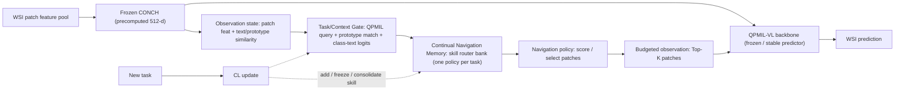

# NaviPath 研究上下文（給新 session 讀）— 2026-06-27 大轉向版

> 本檔是「切換 chat」的接手文件。讀完即可在新 chat 直接接續，不需回溯舊對話。
> 詳細計畫見 `.cursor/plans/navipath_agent_cl_*.plan.md`（若不在，見本檔第 5–9 節）。

---

## 0. 一句話：我們 pivot 了

舊主軸「selector forgetting 診斷 + Top-K budget」被教授（Huei-Fang）打掉，理由成立。
**新主軸：NaviPath-CL — A Continual Navigation Agent for Budgeted WSI Classification。**
不丟舊結果：把 selector-forgetting / per-task 恢復 / EWC 失敗，**降級成 motivation + ablation**，改用正面架構交卷。

教授 bottom line（原話精神）：7/3 不要再主打防守性的 selector 結果；拿出一個「WSI navigation agent + CL 能力」的**正面架構（要架構圖，老師要審）**，7/2 前做多少實驗報多少。

**核心目標時程：6/30 前要「有想法 + 有架構 + 有實驗結果」；7/1–7/2 收圖表寫稿；7/3 報告。**

---

## 1. 新框架（一句話 claim）

> WSI 持續學習不只是學分類器，也是學「怎麼看」。在 agentic / budgeted WSI 設定下，**observation policy 本身也會 catastrophic forgetting**。因此我們提出一個具 CL 能力的 WSI navigation agent，核心是 **continual navigation skill memory + context gate**。

這比「Top-K 省算力」強很多，且正面回應老師「在現有 navigation agent 上擴增 CL」。

---

## 2. 事後檢討（為何 pivot；新設計要避開的坑）

- **「Top-K 省算力」弱**：encode-all-then-aggregate 下，貴的 CONCH 抽取早做完了 → 改講 **limited / budgeted observation**，不是 compute-saving。
- **「非-CL selector 會忘」不是貢獻**：本來就預期 → 改講 **navigation policy 也需要 CL**。
- **MoE no-go 真因**：experts 改寫特徵餵回凍結 QPMIL → off CONCH manifold → 崩（Forgetting 0.735/0.950）；decoupling 後 experts 變 no-op。→ **MoE 列 future work，不是 7/3 依賴**。
- **Forgetting=0 是結構恆等，不是成果**：改當 control（backbone 不忘、agent 仍忘）。

---

## 3. 架構：NaviPath-CL Agent



模組：frozen CONCH（表徵）／QPMIL-VL（穩定分類器+prototype-text anchor，**不挑戰它的 ACC**）／observation state／budgeted navigation policy／**continual navigation skill memory（skill bank）**／**task/context gate**／CL update（task 邊界 add/freeze/consolidate）。

---

## 4. 三個 contribution（7/3 報告）

1. **新問題設定**：budgeted observation 下的 WSI navigation policy 之持續學習（學新癌種後，還記不記得舊癌種要看哪裡）。
2. **CL-enabled WSI navigation agent 架構**（上圖）。
3. **初步實驗證明 CL 必要且可行**：shared policy 會忘、per-task skill bank 可恢復、EWC-on-router（weight-level）不足。

---

## 5. ⚠️ 第一風險（務必正視）：context gate

> **skill bank + oracle gate（用 task id 選）＝ per-task 模型，不是真 CL。**
> 真正的貢獻**全押在 task-free context gate**（推論時不給 task id 也能選對 skill：用 frozen QPMIL full-patch logits / prototype-match 頻率 / query vector 推斷）。
> 策略：先 oracle gate（upper bound）→ 再做 pilot task-free gate。6/30 若 task-free 只做出部分，誠實說明，oracle 當上界呈現。

---

## 6. 可重用 vs 要新建（最省時）

**重用（不需重跑）**
- navigation policy：`navipath_moe/routers.py::MicroRouterV0`（patch→純量分數→Top-K）。
- 訓練/評估：`train_router_v0.py`（frozen backbone、router-only、hard Top-K、EWC、per-task 三模式）。
- 4 hooks：`navipath_moe/qpmil_adapter.py`。
- consolidation：`navipath_moe/consolidate.py`（dual-importance）。
- 架構圖工具：`tools/draw_arch.py`（把 Selector→Navigation policy、Router→Skill、加 Skill bank/Gate/CL update）。

**重用（結果當證據，數字已驗）**
- recent：ESCA router@64=0.956 vs best heur 0.889（GO）；lung 0.922 vs 0.897（GO）。
- old：ESCA router@64=0.333 vs 0.822（NO-GO）；lung 0.397 vs 0.813（NO-GO）。
- per-task 恢復：reverse old ESCA fold2=0.933、fold3=1.0。
- EWC 不救：reverse old ESCA ~0.40（NO-GO）。
- reverse fold1 old ESCA router@64=0.133（< random 0.8）→ **主動選錯**，不是沒學到。

**要新建（最小）**
- `navipath_moe/continual_agent.py`：`NavigationSkillBank` + `ContextGate`（先 oracle，再 logit/prototype gate）+ `ContinualWSINavigationAgent`（navigate/predict）。

---

## 7. 六天計畫（今天=6/27；6/30 為核心 deadline）

- 6/27：定稿 storyline + Figure 1 + 1 頁 problem statement。
- 6/28：`continual_agent.py` wrapper（skill bank + oracle gate）包 MicroRouterV0；MPS smoke（能 navigate→predict）。
- 6/29：彙整證據（重用結果）；可選補 paper-order per-task + EWC 對稱（指令見下）。
- 6/30：**pilot task-free context gate（logit/prototype gate）+ 對 oracle 上界比較 ← 核心交付**。
- 7/1：5 張核心圖表。
- 7/2：凍結結果、寫 7/3 報告稿、不加新實驗。

可選對稱補跑（RunPod tmux）：
```bash
for FOLD in 1 2 3; do
  python train_router_v0.py --backbone-ckpt outputs/qpmil_paper_fold${FOLD}.pt \
    --order paper --fold $FOLD --eval-tasks="-1,0" --epochs 5 --router-consol pertask
done
```

---

## 8. 六天內不要做

重抽 CONCH features；真 RL/PPO navigation；完整 MoE；省算力宣稱；把 EWC 當主解法（它是 negative baseline）。single-step 可微 Top-K / soft-route 已足夠稱 budgeted navigation policy 原型。

---

## 9. 5 張核心圖表（7/3）

1. 架構圖（NaviPath-CL agent）。
2. 問題：shared policy recent GO / old NO-GO。
3. CL memory：per-task skill bank 恢復舊任務。
4. EWC negative：weight 正則不足。
5. Roadmap：oracle gate → task-free gate → selection-aware consolidation → multi-step navigation。

---

## 10. 環境 / 關鍵檔案 / 資料（沿用）

- 開發：Mac（MPS）構思 + Cursor 寫 code + smoke test；重活貼到 **RunPod，tmux** 跑。
- 資料：`data/` → symlink `/Users/aaron/research/can_dataset`；CONCH 權重 `checkpoints/conch/pytorch_model.bin`。
- QPMIL repo：`QPMIL-VL/`（已 vendored）。我們的 code：`navipath_moe/`、`eval/`、`configs/`、`tests/`。
- 資料規模：lung 1054 / brca 1133 / rcc 937 / esca 158；patch ~3000/slide；512-d CONCH。
- task order：paper = lung→brca→rcc→esca；reverse = esca→rcc→brca→lung；label shift [0,2,4,6]（class-incremental，不給 task id）。
- 既有 ckpt：`outputs/qpmil_{paper,reverse}_fold{1,2,3}.pt`。
- 注意：transformers 鎖 4.x（CONCH tokenizer 需 batch_encode_plus）；router 訓練用 soft-weighted（可微）、評估用 hard top-K。

---

## 11. 舊資料定位（不要刪，當 motivation/ablation）

`PAPER_DRAFT_v0.4.md`、`REPORT_zh_v0.4.md`、`ROUTER_FORGETTING_v0.4.md` 等是**舊「selection forgetting 診斷」主軸**。**新主軸是 navigation agent + CL**；舊內容降級為 motivation 與 ablation 證據來源，勿當主張。
