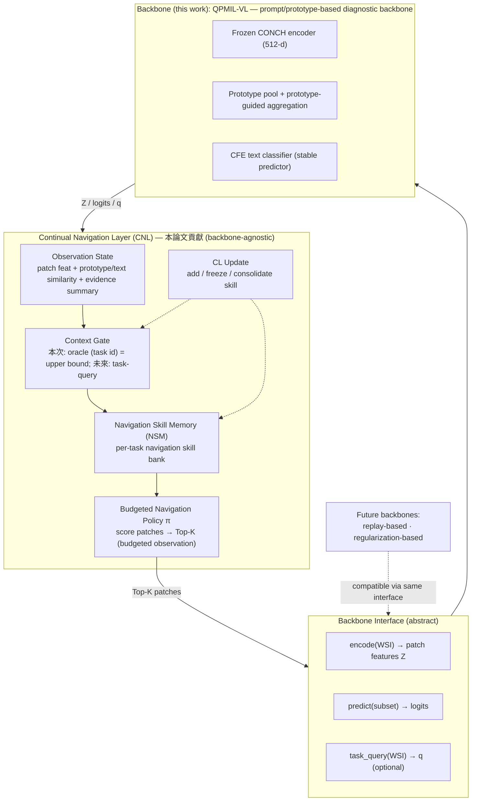

# NaviPath-CL — Storyline（拍板基調）

> **題目**：*NaviPath-CL: A Continual Navigation Layer for Agentic Whole-Slide Image Diagnosis*
> 本檔是 7/3 雙月報告與後續論文的「敘事錨」。基調已拍板。
> 配套：進度看 `SESSION_CONTEXT.md`、合作規矩看 `COLLAB_PLAYBOOK.md`、QPMIL-VL 細節見其論文（arXiv:2410.10573）。

> **保密**：上位計畫一律以 **North Star** 代稱（= 長期願景：physician-like pathology navigation agent）。文件內不出現計畫名稱、單位、主持人、頁碼等可識別資訊。

---

## 0. 命名（固定用詞）

| 項目 | 名稱 |
|---|---|
| 整體方法 | **NaviPath-CL** |
| 貢獻層 | **Continual Navigation Layer (CNL)** |
| 核心模組 | **Navigation Skill Memory (NSM)** |
| 上位願景代稱 | **North Star**（physician-like WSI navigation agent） |

---

## 1. 兩套語言（最重要的紀律）

兩個 audience，兩套敘事，**不可混用**：

| Audience | 要聽的故事 |
|---|---|
| 老師 / North Star 內部 | NaviPath-CL 是 North Star physician-like WSI navigation agent 的 **Phase-0 CL 原型** |
| Paper reviewer | 一個新的 WSI-CL 問題：**continual learning of the observation policy under budgeted WSI inference** |

```text
Internal / North Star framing : Phase-0 prototype for a physician-like WSI navigation agent.
Paper framing                 : Continual learning for budgeted WSI observation policies.
```

> 論文裡不過度講 North Star——它是內部合理性來源；paper 要講獨立的 scientific problem，不能讀起來像計畫 deliverable 延伸。

---

## 2. 拍板主軸（一段話）

> **NaviPath-CL is a Phase-0 continual navigation prototype for physician-like WSI agents.** Before real physician trajectory and RLHF data are available, we abstract WSI navigation as budgeted patch selection over precomputed CONCH features, using QPMIL-VL as a frozen prompt/prototype-based diagnostic backbone. Our preliminary study asks **which continual mechanism is suitable for such a navigation policy.** Results suggest that a single shared policy and EWC-style regularization are insufficient, while modular **navigation skill memory** can recover old-task observation behavior. This motivates a **Continual Navigation Layer** for future agentic WSI diagnosis.

One-liner（不含 task-free；留 future）：

> WSI 持續學習不只是學「怎麼分類」，也是學「**怎麼看**」。在 budgeted / agentic 病理診斷下，navigation policy 本身也會 catastrophic forgetting。CL 發生在 agent 的 **Navigation Skill Memory**，而非 classifier。

---

## 3. 問題設定

- 現行 patch-by-patch / encode-all 把運算花在非重要區域，且非關鍵區域特徵會干擾診斷；醫師行為是「低倍率找標的 → 高倍率細看」。
- 既有仿醫師方法未用醫師實際軌跡，靠弱監督/報告找區域，可能找錯目標或幻覺。
- 新問題：**有限 observation budget 下，agent 學新癌種後，還記不記得舊癌種「要看哪裡」？** 既有 WSI-CL 只處理 classifier forgetting，沒人處理 navigation-policy forgetting。

---

## 4. Mechanism Selection for Continual WSI Navigation（報告主實驗邏輯）

> 本節不是「列四個方法」，而是回答一個設計問題：**Which continual mechanism is suitable for a WSI navigation agent?**

| Mechanism | North Star 對應 | 實驗變體 | 代表問題 | 訊息 | 狀態 |
|---|---|---|---|---|---|
| Shared module | 單一導覽 agent 持續更新 | shared router | 一個共用 policy 能學所有任務嗎？ | recent 好、old 崩 → 不夠 | ✅ 已有結果 |
| Weight regularization | 保留舊知識、避免漂移 | EWC router | 只約束參數能防 forgetting 嗎？ | 不夠 → forgetting 更結構性 | ✅ 已有結果 |
| Modular skill memory | per-task LoRA / Adapter | per-task router / skill bank | 保存 task-specific navigation skill 有效嗎？ | 有效 → CL upper bound | ✅ 已有結果 |
| Parameter merging / consolidation | 可合併 adapter（避免膨脹） | consolidation variant（`consolidate.py`） | 能否不無限增長參數下整合 skills？ | **待完成** | ⏳ ongoing / planned |

**措辭紀律（避免過度宣稱）**：
- shared / EWC / per-task：可講得確定。
- consolidation / parameter merging：**只講 ongoing，不 claim solved**。
- 安全句：*We conduct an initial mechanism probe over North-Star-proposed continual mechanisms in a Phase-0 navigation setting. A single shared policy and weight regularization are insufficient; modular skill memory is the more reliable direction; scalable consolidation / merging is ongoing.*

---

## 5. 決策樹式 argument（7/3 slide 用）

```text
Q1: Can a single shared navigation policy continually learn all tasks?
    → No. Works for recent tasks but fails on old tasks.
Q2: Can standard weight-level CL regularization (EWC) fix this?
    → Not sufficiently. Old-task navigation remains weak.
Q3: Is the old navigation skill fundamentally lost?
    → No. Per-task skill memory recovers old-task performance.
Conclusion:
    The issue is not lack of diagnostic signal, but lack of continual navigation memory.
```

---

## 6. 框架：backbone-agnostic Continual Navigation Layer (CNL)



**模組對應 North Star**：Navigation Policy ↔ 導覽 agent action policy；NSM / CL Update ↔ adaptive learning + memory module；Context Gate ↔ orchestrator。

---

## 7. QPMIL-VL 定位（固定寫法）

> **QPMIL-VL 在本工作中被定位為 prompt/prototype-based diagnostic backbone，並提供 Phase-0 導覽學習所需的弱監督訊號。** 它**不是** replay memory，也**不是**我們要打敗的對手。

> **English**: We do not treat QPMIL-VL as a replay mechanism. Instead, we use its prompt/prototype-based reasoning signals (prototype/text similarity) to construct a proxy navigation objective before physician trajectory data becomes available.

---

## 8. 三個 contribution

1. **新問題設定**：budgeted observation 下 navigation policy 的持續學習（physician-like navigation 的 Phase-0 抽象）。
2. **backbone-agnostic Continual Navigation Layer (CNL)**：backbone 介面 + Navigation Skill Memory + context gate + CL update；QPMIL-VL 為 prompt/prototype-based backbone，框架可推廣至其他 CL 家族。
3. **機制探查（mechanism probe）**：shared 不夠、EWC 不夠、modular skill memory 可恢復 → CL 須在 skill/memory 層。

---

## 9. 證據（重用，數字已驗，不需重跑）

- shared policy：ESCA router@64 **0.956** vs best heur 0.889（GO）；lung 0.922 vs 0.897（GO）。
- old task：reverse old ESCA router@64 **0.133 ≪ random 0.8**（主動選錯，不是沒學到）。
- per-task skill bank：reverse old ESCA fold2 **0.933**、fold3 **1.0**（恢復）。
- EWC negative：reverse old ESCA ~**0.40**（不足）。

---

## 10. Scope statement（誠實邊界，務必寫進報告）

- 只實例化**一個 backbone（QPMIL-VL，prompt/prototype-based VLM）**；跨 CL 家族驗證列 future。
- navigation = budgeted **patch selection**（Phase-0）；尚無 zoom/move、多尺度、醫師軌跡、真 RLHF、order-aware reward。
- reward = WSI label / QPMIL confidence（**doctor-trajectory-unavailable 的 proxy**）。
- Context gate 用 **oracle（task id）作 upper bound**；task-free gate 列 future（後續 ~3 週內 pilot）。
- 不主打 compute-saving；budget 是 agentic observation constraint。Forgetting=0 是結構恆等，當 control。

> 安全措辭：*This is a preliminary, Phase-0 abstraction toward physician-like WSI navigation; we currently approximate navigation as budgeted patch selection over precomputed WSI features.*

**Do not claim**：full physician imitation／task-free routing solved／compute saving under encode-all／raw WSI browser agent／complete RLHF／parameter merging solved。

---

## 11. Phase roadmap（對齊 North Star）

| 階段 | North Star 目標 | 我們現在 / 將來 |
|---|---|---|
| **Phase 0（本次 7/3）** | 無醫師軌跡前的導覽原型 | QPMIL/CONCH feature 上的 budgeted patch navigation + NSM CL |
| Phase 1 | 學習醫師 WSI 瀏覽軌跡 | doctor trajectory 訓練 action policy（move/zoom）、order-aware reward |
| Phase 2 | 人機協作持續適應 | 醫師 feedback + feature replay memory + PEFT/LoRA + parameter merging |

---

## 12. 時程

- **7/2**：基調定稿 + pilot 完成 + **雙月報告**。pilot = NSM（oracle gate）wrapper 能 navigate→predict，補齊 paper-order per-task / EWC 對稱證據。
- **7/3**：報告（架構 + pilot + pivot plan；不假裝 paper 已完成）。
- **7/15**：論文初稿差不多定稿（**老師 review**）。
- **7/20**：年度報告。
- 7/3–7/15：把 pilot 做成論文；可選 task-free gate / consolidation pilot 補強。
