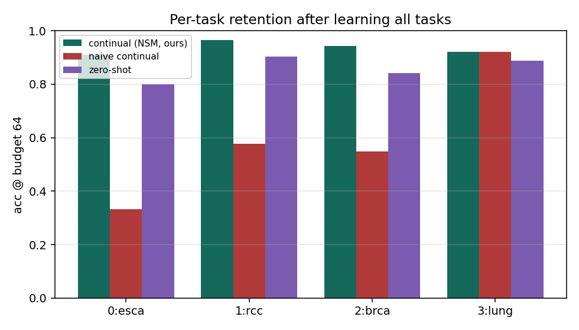
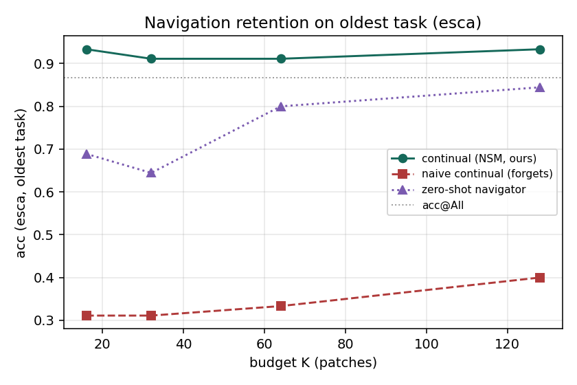

# NaviPath-CL 雙月報告（2026-07-03）

> 敘事基調見 `STORYLINE.md`；架構 authoritative 見 `specs/decisions/ADR-0006-*.md`；答辯底稿見 `docs/wiki/07~10`。
> **保密**：上位計畫一律以 **North Star** 代稱，文中不含計畫名稱／單位／主持人。
> 結果凍結快照：reverse order、3-fold、oracle gate、seq 模式。來源 `outputs/RESULTS_seqobs_20260628.md`、`analyze_seqobs_n3.py`。

---

## 1. 一頁摘要

- **定位**：NaviPath-CL 是 **North Star**（physician-like WSI navigation agent）的 **Phase-0 原型**。它在一個**凍結的診斷 backbone** 之上，外掛一層通用、backbone-agnostic 的 **Continual Navigation Layer (CNL)**——研究 budgeted／agentic WSI 設定下「**該看哪些 patch（navigation policy）**」的 **continual learning**。QPMIL-VL 只是本次插入的一個 backbone 實例。
- **問題（呼應 ZeroSlide）**：近期工作顯示「**分類**」可用 frozen 病理 VLM 做 zero-shot、天生不遺忘。但只要要做有預算、會主動「看哪」的 agent，就需要一個**可訓練的 navigator**，而它一旦在任務流上連續訓練就會**遺忘**。**「navigation 也需要 CL」這條臨床關鍵軸，過去沒人立起來。**
- **主結果**（reverse，4 任務平均 mACC，budget=64，跨 3 fold）：
  - naive 連續訓練單一 policy → **mACC 0.595、Forgetting 0.454**（最舊任務 esca@64 掉到 **0.333**）。
  - 我們的 **per-task Navigation Skill Memory（NSM）→ mACC 0.935、Forgetting 0**（esca@64 救回 **0.911**）。
  - **zero-shot navigator**（不訓練、frozen-FM 文字相似度選 patch）→ **mACC 0.858**：強，但仍輸我們，且 > naive。
- **結論**：WSI 持續學習不只在「怎麼分類」，也在「**怎麼看**」。navigation 會遺忘、且可被記憶修復；zero-shot navigation 是強 baseline 但不足，**continual navigation learning 再加值（+0.077 mACC）**。

---

## 2. 背景與定位（為何不以 QPMIL 開頭）

- **通用 module = 我們的貢獻本體**：CNL 是一層獨立、可換 backbone 的導覽層。它的通用性由**介面契約**界定（backbone 需提供 per-patch features、子集可定義的預測、per-patch relevance；見 `docs/wiki/05`）。**QPMIL-VL 是 Phase-0 的一個 instance，不是要打敗的對手，也不是敘事起點。**
- **與 North Star 對齊**：在尚無真實醫師軌跡與 RLHF 前，把 full navigation 抽象為 **budgeted patch selection over precomputed CONCH features**，以 WSI label 作 weak supervision。後續（task-free gate、skill consolidation、move/zoom、醫師軌跡、RLHF）見 §6 roadmap。

---

## 3. 方法（兩條正交軸）

> 通用架構（vector）見 `site/figs/arch_navipath_cl.svg`；互動說明見看板 `site/architecture.html`。

| 軸 | 管什麼 | 模組 |
|---|---|---|
| **Agent（怎麼看）** | 一張片內、在 budget K 下多步累積證據決定「下一步看哪、何時停」，輸出可解釋 Navigation Trace | Observation State + Sequential Budgeted Observation |
| **CL（怎麼不忘）** | 學了新癌症後，舊癌症「該看哪」不退化 | Navigation Skill Memory (NSM) + Context Gate |

- **Navigation Policy（router）**：唯一可訓練元件；對每個 patch 打「對診斷的判別力」分數。**無 patch-level 標註**，只用 slide-level label 弱監督學會 where-to-look（聚合被選 patch → 凍結分類頭 → 對 label 算 loss，梯度只回 router）。
- **NSM 的角色（重要、誠實）**：Phase-0 以 per-task 權重快照存技能、oracle gate 取用。**這是「no-interference 上界」，不是終點方法**——它的作用是**框出問題大小**（naive 下界 0.595 ↔ 上界 0.935 的 gap）。真正的方法是用**便宜記憶**（prompt／prototype／low-rank／replay）逼近此上界，並以 **task-free gate** 取代 oracle。詳見 `docs/wiki/10`。
- **zero-shot navigator baseline（回應 ZeroSlide）**：同一架構、只把打分來源從 router 換成 CONCH patch-text 相似度，不訓練。用來檢驗「zero-shot navigation 夠不夠」。

實作：`navipath_moe/continual_agent.py`（NSM/Gate）、`navipath_moe/sequential_observation.py`（序列觀察 + `policy_mode`）、`eval_sequential_observation.py`、`analyze_seqobs_n3.py`。

---

## 4. Pilot 結果（N2 訓練 / N3 分析）

任務序 reverse：0=esca（最舊）→ 1=rcc → 2=brca → 3=lung（最新）。oracle gate，seq，budget=64，3-fold mean±std。

### 4.1 Retention（學完全部任務後各任務 acc@64）

| 任務 | continual+NSM（我們） | naive continual（會忘） | zero-shot navigator |
|---|---|---|---|
| 0 esca（最舊） | **0.911±0.031** | 0.333±0.144 | 0.800±0.094 |
| 1 rcc | **0.965±0.025** | 0.576±0.076 | 0.904±0.060 |
| 2 brca | **0.944±0.013** | 0.549±0.054 | 0.841±0.040 |
| 3 lung（最新） | 0.922±0.020 | 0.922±0.020 | 0.888±0.026 |

> lung（最新任務）三者相同＝合理 sanity（最新任務還沒被後續任務覆蓋）。

### 4.2 CL 指標

| 指標 | continual+NSM（我們） | naive continual | zero-shot |
|---|---|---|---|
| mACC（越高越好） | **0.935±0.017** | 0.595±0.035 | 0.858±0.038 |
| Forgetting（舊任務，越小越好） | **0.000** | 0.454±0.041 | 0.000 |

### 4.3 Budget 效率（最舊任務 esca）

我們在 budget 16/32/64 都維持 ~0.91（達到甚至超過 acc@All 0.867）→ **少少 patch 就抓到診斷重點**；naive 在各 budget 崩到 ~0.33。

### 4.4 三層敘事
1. **naive 可訓練 navigator 嚴重遺忘**（0.595 / Forgetting 0.454）→ 問題真實。
2. **NSM 完全修復**（0.935 / Forgetting 0）→ 問題可解（上界）。
3. **zero-shot 強但仍輸我們**（0.858 < 0.935）且 **> naive（0.595）**→ 回應 ZeroSlide：不訓練比亂訓練好，但 learned + 記憶的 navigation 再加值。

---

## 5. 老師疑慮回應（已寫入 `docs/wiki/09,10`、看板答辯筆記）

- **「encode 完才選，budget 還省算力嗎？」**：承認在 encode-all 流程下「省 predictor 算力」站不住。budget 的真正角色改為 **(a) 臨床可稽核**（短、有序、可驗證的 Navigation Trace 證據鏈）、**(b) 下游每-patch 成本高**（餵大型 VLM／agent 逐 patch／高倍重讀／人工複閱時 K≪n 放大百倍）、**(c) 指向 select-before-encode 的未來設計**。
- **「selection forgetting 是 trivial 嗎？」**：承認任何 trainable 模組連續訓練都會忘。我們的貢獻**不是「發現遺忘」**，而是 **(1) 把 navigation 立成 CL 新軸並量化、(2) 提供修復（NSM 上界 + 便宜記憶路線）、(3) task-free gate 才是真難題**。
- **「不就是把東西存下來？」**：是的，pilot NSM 就是上界工具；**零遺忘是起點不是賣點**（見 §3、`docs/wiki/10`）。

---

## 6. 結論與 roadmap

- **結論**：navigation policy 在 WSI 持續學習下會遺忘；NSM 證明可修復；zero-shot navigation 不足以取代 continual navigation learning。提出 CNL 作為 agentic WSI 診斷的可持續學習層。

- **下一步**：
  1. **多步 agent 真增益**：路線 A 推論期自適應選擇（λ/redundancy，Mac 可做）→ B 信心早停（τ）→ C RL 學搜尋（reward = 最小 budget 下診斷正確，label-only，需 GPU）。
  2. **便宜記憶**：per-task full router → prompt／low-rank／replay，壓縮記憶並共享主幹。
  3. **task-free Context Gate** 取代 oracle。
  4. paper-order 對稱實驗、EWC 正則 baseline（論文補強，需 GPU）。

---

## 7. 誠實邊界（do-not-claim）

- **多步尚未贏單步**：本版 seq == oneshot（差 0），因 policy 分數尚未依賴已觀察內容（靜態打分）。屬設計增量、非 bug；修法見 §6.1 與 `docs/wiki/10` §3。
- 不宣稱 compute-saving、不宣稱 task-free / consolidation 已解決、不宣稱論文完成。
- 目前完整資料為 **reverse order、3-fold**；paper-order 對稱與 EWC 在新框架的數字待補（GPU）。
- oracle context gate 為 upper bound；task-free gate 為 future。

---

*附：開發與決策記錄見 `specs/`（README/ADR/SPEC/WORKLOG）；答辯底稿見 `docs/wiki/07~10`、看板 `site/notes.html`。*
