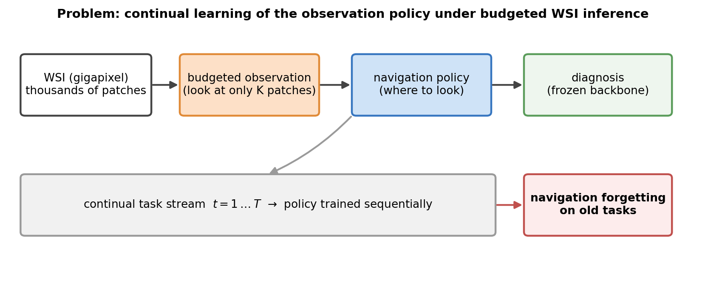
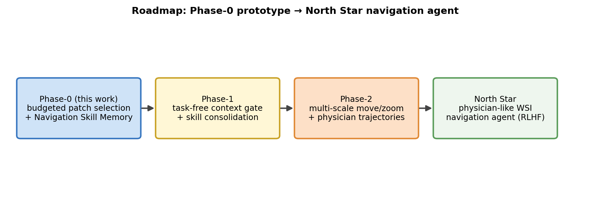
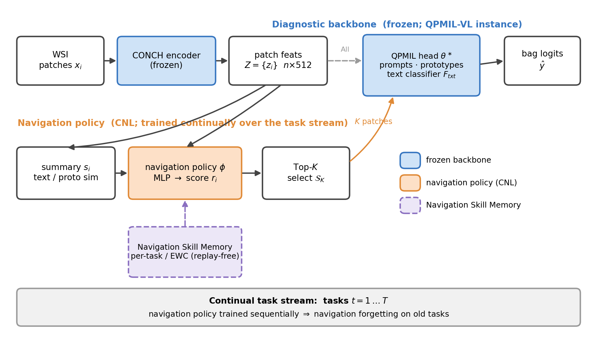
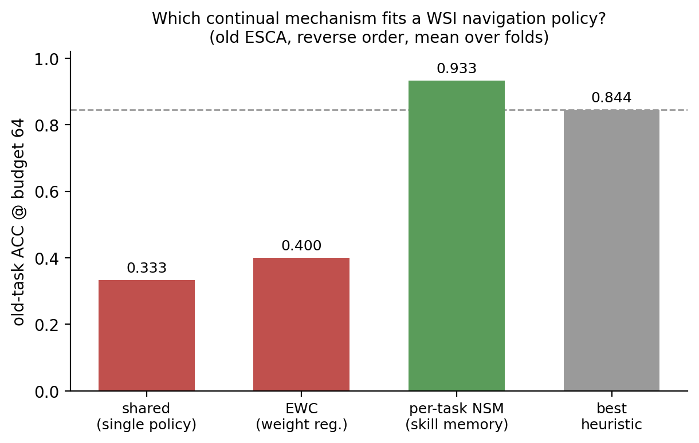
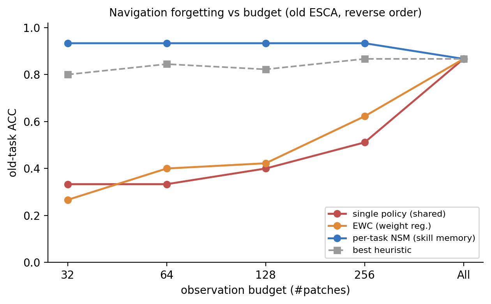

# NaviPath-CL 雙月報告（2026-07-03）

> 本稿對應 [SPEC-04](../specs/features/SPEC-04-report-0703.md)。敘事基調見 `STORYLINE.md`。
> **保密**：上位計畫一律以 **North Star** 代稱，文中不含計畫名稱／單位／主持人等可識別資訊。
> 結果已於 7/2 凍結（frozen snapshot，見 §8）。

---

## 1. 一頁摘要

- **Pivot**：原「trainable patch selector 會遺忘 + Top-K 省算力」主軸已被否定（encode-all 下省算力站不住、無 CL 元件的 selector 會忘屬預期）。我們將其**升格**為 **NaviPath-CL**：研究 budgeted/agentic WSI 設定下，**navigation policy 本身的 continual learning**。
- **定位**：NaviPath-CL 是 **North Star**（physician-like WSI navigation agent 長期願景）的 **Phase-0 CL 原型**。
- **主發現**（reverse order，舊任務 ESCA，budget 64，跨 fold 平均）：單一共用 policy 會遺忘（0.333）、EWC 正則不足（0.400）、而 **per-task navigation skill memory 可恢復舊任務導覽行為（0.933）**，超越所有 training-free heuristic（0.844）。
- **結論**：WSI 持續學習不只在「怎麼分類」，也在「怎麼看」；需要一層 **Continual Navigation Layer (CNL)** 與其核心 **Navigation Skill Memory (NSM)**。

---

## 2. 背景與 pivot

舊主軸聚焦「selector 遺忘診斷 + 算力節省」，存在三個致命問題：
1. 在 encode-all-then-aggregate 流程下，昂貴的 CONCH 特徵抽取已完成，「省算力」不成立。
2. 沒有 CL 元件的 selector 會遺忘是預期現象，不構成貢獻。
3. decoupled backbone 的 Forgetting=0 是結構恆等，非成果。

**Pivot 結論**：不另開新坑，而是把既有 selector 工作升格為「Continual WSI Navigation Agent」，把焦點從「分類遺忘」移到 **navigation / observation policy 的遺忘**。舊結果保留為 motivation 與 ablation。

詳見 `specs/decisions/ADR-0001`。

---

## 3. 問題定位

WSI 為 gigapixel 影像、含數千個 patch。實務（與醫師行為）下，模型只能在 **有限觀察預算 (budgeted observation)** 內決定「看哪些 patch」——這是一個 navigation / observation policy。當任務以串流方式持續到來（continual task stream），此 policy 會對舊任務發生 **catastrophic forgetting**：對新任務看得準，對舊任務「不會看了」。

Paper framing：**continual learning of the observation policy under budgeted WSI inference**。

---

## 4. North Star 對齊

NaviPath-CL 是 North Star physician-like WSI navigation agent 的 **Phase-0 原型**。在尚無真實醫師軌跡與 RLHF 資料前，我們把 full navigation 抽象為 **budgeted patch selection over precomputed CONCH features**，並以 WSI label / QPMIL-VL 的 prototype-text 訊號作 weak supervision。後續階段（task-free gate、skill consolidation、move/zoom、醫師軌跡與 RLHF）見 §7 roadmap。

---

## 5. 方法

- **Diagnostic backbone（frozen）**：QPMIL-VL 作為 prompt/prototype-based、rehearsal-free 的診斷 backbone 與 weak supervisory signal。**不是 replay、也不是要打敗的對手**；它是 CNL 的一個 backbone instance（框架 backbone-agnostic）。
- **Continual Navigation Layer (CNL)**：在 backbone 之上、可持續訓練的 navigation policy（patch → importance score → Top-K 觀察）。
- **Navigation Skill Memory (NSM)**：保存各任務的導覽技能，緩解 navigation 的 catastrophic forgetting。本次以 per-task skill bank（上界）與 EWC（負面 baseline）兩種機制驗證；consolidation / parameter-merging 為 ongoing。

實作：`navipath_moe/continual_agent.py`（NSM + Context Gate + Agent）、`navipath_moe/qpmil_adapter.py`（backbone 4-hook）、`eval_continual_agent.py`（end-to-end 評估）。

---

## 6. Pilot 證據（mechanism selection）

核心問題：**哪一種 continual 機制適合 WSI navigation policy？** 以決策樹回答（reverse order，舊任務 ESCA，budget 64，跨 3 fold 平均）：

| 機制 | 舊任務 ACC@64 | 對應 North Star 設計 | 判定 |
|---|---|---|---|
| shared（單一共用 policy） | **0.333** | 單一導覽 agent | NO-GO（< heuristic 0.844） |
| EWC（weight 正則） | **0.400** | weight 正則 / alignment | 不足 |
| per-task NSM（skill memory） | **0.933** | PEFT per-task / skill bank | **恢復（> heuristic）** |
| best heuristic（random/proto/semantic） | 0.844 | — | 參考線 |
| consolidation / parameter-merging | — | 參數合併 | **ongoing（尚無 navigation 數字）** |

**決策樹**：
- Q1 單一共用 policy 能學會所有任務嗎？→ 否（新任務 GO、舊任務 0.333，GO 0/3 fold）。
- Q2 weight 正則（EWC）能修嗎？→ 不足（0.400，GO 0/3）。
- Q3 舊的 navigation skill 真的丟失了嗎？→ 否（per-task NSM 0.933，GO 3/3）→ 訊號仍在，是「記憶」問題。

**詮釋**：問題不在缺乏診斷訊號，而在缺乏 **continual navigation memory**。這正是 CNL/NSM 的動機。

---

## 7. 結論與 pivot plan

- **結論**：navigation policy 在 WSI continual learning 下會遺忘；NSM 能恢復舊任務導覽行為。提出 CNL 作為未來 agentic WSI 診斷的可持續學習層。
- **Future（3 週內可選補強 → 論文）**：
  1. task-free **Context Gate**（用 QPMIL MaxPooling query 對 prototype-match / full-patch logits 推 task），取代 oracle gate。
  2. **skill consolidation / parameter-merging**（控制 per-task 參數膨脹）。
  3. 多尺度 move/zoom、醫師軌跡、order-aware reward、RLHF（North Star 後續階段）。

---

## 8. 誠實邊界（do-not-claim / frozen snapshot）

**凍結結果（7/2）**：本報告數字與圖來自 `outputs/MECHANISM_SELECTION.md`、`outputs/RESULTS_SUMMARY.md` 與 `outputs/figs/`，報告期間不再加新實驗。

**尚未完成 / 不宣稱**：
- 不宣稱 paper 已完成、不宣稱 compute-saving、不宣稱 task-free / consolidation 已解決。
- per-task / EWC 的 **paper-order 對稱** 補跑待 RunPod（目前 reverse order 完整、paper order 只有 shared）。
- agent end-to-end 的**真數字重現（0.933）** 已備好 RunPod 指令（`eval_continual_agent.py`），Mac 僅完成 pipeline smoke。
- oracle context gate 為 upper bound；task-free gate 為 future。

---

*附：開發過程與決策記錄見 `specs/`（README/ADR/SPEC/WORKLOG）。*
