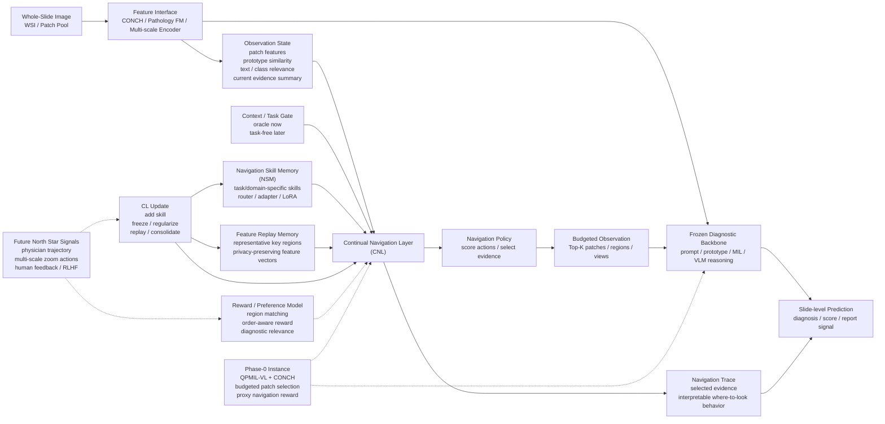

# ADR-0006 — 放棄「機制探查(A)」，改做 generalized 新架構(B)

- Status: Accepted（Aaron 拍板，2026-06-27）
- Date: 2026-06-27
- Supersedes: **ADR-0003（mechanism-selection framing）整份作廢**
- Amends: ADR-0001（pivot 仍有效，但「賣點=機制探查」這部分被本 ADR 取代）

## Context（為什麼又改）

ADR-0001 pivot 後，敘事落在「**A：誠實 Phase-0 機制探查**」——比較 shared / EWC / per-task，
用 mechanism-selection 表 + 決策樹論證「CL 該放在 navigation memory」。

Aaron 明確否決 A 作為最終定位：

> 「A 一定要完全放棄，這是最重要的前提。一定不要再機制探查。而是新架構。」

關鍵問題：目前實作（`continual_agent.py` + `MicroRouterV0` per-task skill bank）**就是舊 selector 換皮**，
而且只覆蓋新架構的一小塊。機制探查（shared vs EWC vs per-task 的 GO/NO-GO 對比）正是被老師打槍的舊框架延伸。

## Decision

主軸改為提出一個 **generalized 新架構**（不綁死 QPMIL，QPMIL-VL 只是 Phase-0 instance；不提 funding，只寫 North Star）。

**標題（拍板）：**
> NaviPath-CL: Generalized Continual Navigation Layer for Agentic WSI Diagnosis
> （簡潔版：NaviPath-CL: Continual Navigation for Agentic WSI Diagnosis）

**架構（authoritative，後續所有圖/文以此為準）：**

**核心語言（圖中模組 → 目前對應）：**

| 圖中模組                       | 目前對應                                |
| -------------------------- | ------------------------------------- |
| Feature Interface          | precomputed CONCH features            |
| Frozen Diagnostic Backbone | QPMIL-VL                              |
| Continual Navigation Layer | 新貢獻層                                  |
| Navigation Policy          | 原本 router / selector                  |
| Navigation Skill Memory    | per-task router / future adapter bank |
| Feature Replay Memory      | 未來可存代表性 patch features                |
| Context / Task Gate        | 現在 oracle，未來 task-free                |
| North Star Signals         | 未來醫師軌跡、zoom action、RLHF               |

## Consequences

### 作廢（不再作為論文主軸 / 要從敘事移除）
- mechanism-selection 表（shared vs EWC vs per-task 對比作為**主結果**）。
- 決策樹式 argument（Q1/Q2/Q3 → conclusion）。
- `FigS1_arch`（"Patch selectors / GO-NO-GO" 圖）= 舊框架，棄用。
- STORYLINE §2 one-liner（"which continual mechanism…"）、§4、§5、§8 contribution#3 需改寫。
- `site/` 的「機制探查」段落、`tools/mechanism_table.py` 的主軸地位降為內部 ablation（可留但不主打）。

### 可重用（map 到新架構，非全丟）
- `continual_agent.py`：NSM ↔ Navigation Skill Memory；ContextGate ↔ Context/Task Gate；agent 介面 ↔ CNL 殼。
- `MicroRouterV0`：作為 Navigation Policy 的 **Phase-0 instance**。
- 既有 per-task / 數字：降為 motivation / ablation（呼應 ADR-0001）。

### 尚未實作（新架構真正要補的「肉」）
- Observation State：真正會**累積證據**的 state（非單步）。
- Budgeted Observation：**序列/多步**觀察（非一次性 Top-K）。
- Feature Replay Memory（FRM）：存代表性 patch features。
- CL Update：add / freeze / regularize / replay / consolidate 的統一介面（非只有 per-task）。
- Reward / Preference Model：region matching / order-aware reward（future North Star signals）。
- Navigation Trace：可解釋的 where-to-look 輸出。

## 落點
- 敘事真相同步更新到 [`../../STORYLINE.md`](../../STORYLINE.md)（待改寫）。
- 架構圖重畫，忠實對應上面 mermaid（取代舊 `Fig1_arch` / `FigS1_arch`）。
